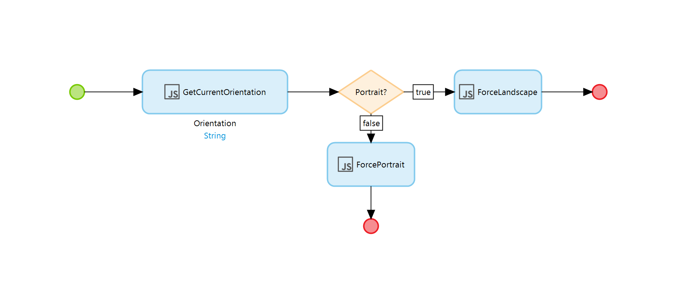

# Orientation-Native

Javascript actions to dynamically set the orientation of your Native app, using https://github.com/yamill/react-native-orientation

### Features

* Get the current device orientation
* Force device orientation

### Installation

* Follow instructions [here](https://github.com/yamill/react-native-orientation#installing) to install the Native package in your Native Project Directory

### Implementation

Use the three included javascript actions in your nanoflows as needed

### TODO:

- [ ] Expose as Nanoflow actions

